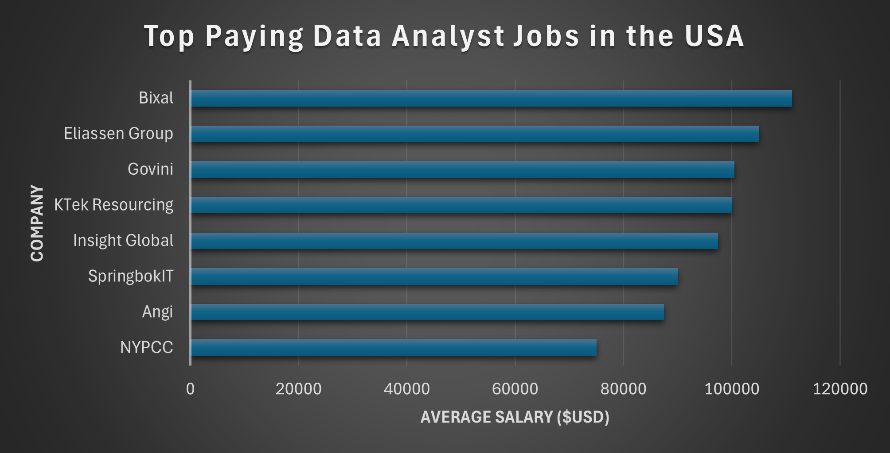
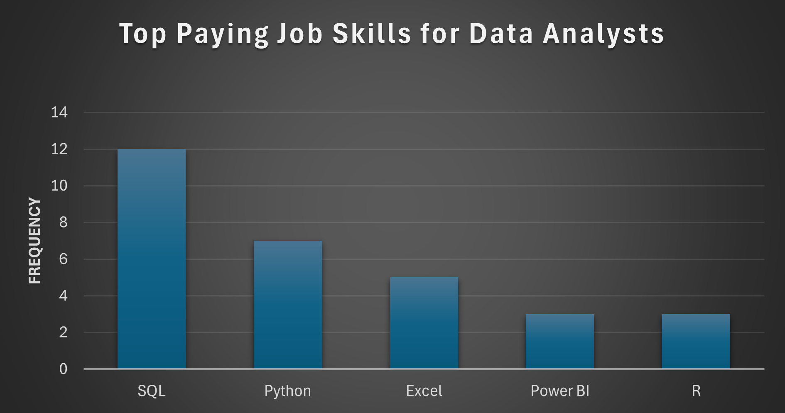
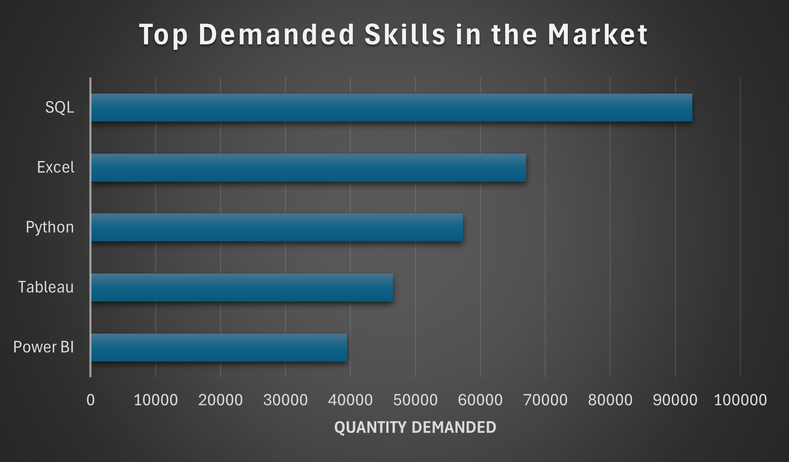

# Introduction
In this project, I explored the job market for different roles in the Data Science field. Using SQL, I analyzed real job listings to understand trends in job titles, salaries, locations, and required skills. The goal was to get a clearer picture of what the industry looks like and what employers are really looking for.

Want to see the actual SQL queries I used?
Check them out here 👉 [project_sql folder](/project_sql/)

# Background
The Data Science field is broad and constantly evolving — with job titles, required skills, and salaries varying a lot across roles. To better understand where I stand and where I can grow, I set out to explore real job market data using SQL.

This project was part of an SQL course I completed — [SQL Course](https://www.lukebarousse.com/sql) — which covered the essentials of SQL for Data Analysis and provided the dataset used in this work. The course gave me both the technical skills and the data needed to dive into real-world questions about the job market.

### The main goal of this project was to answer some key questions that matter to anyone pursuing a career in Data Science:

1. Which roles in Data Science offer the highest salaries?

2. What skills are most commonly required for these top-paying jobs?

3. Which skills are currently in highest demand across the market?

4. How do certain skills influence salary within a given role?

5. What are the most valuable skills to focus on learning next?

# Tools I Used
To complete this project, I worked with a combination of tools that helped me write queries, manage my code, and visualize the results:

- **SQL (PostgreSQL):** The main language I used to explore and analyze the dataset.

- **Visual Studio Code:** Convenient editor for writing and testing SQL queries.

- **Git & GitHub:** For version control and sharing my project online.

- **Excel:** Used to create charts and visual summaries of the data for better insights.

These tools gave me everything I needed to go from raw data to real, understandable results.

# The Analysis
📊To explore the job market in Data Science, I wrote a series of SQL queries that helped me dig into job listings and extract meaningful insights. Below are the key questions I aimed to answer and what I found.

### 1. Which companies offer the highest salaries for Data Analyst?
**To identify:** Top-paying Data Analyst jobs located in the United States, where salary information is available. The purpose was to understand salary trends and which companies are currently offering the most competitive salary for this role.

```SQL
SELECT 
    job_id,
    job_title,
    job_location,
    job_schedule_type,
    salary_year_avg,
    job_posted_date,
    company_dim.name AS company_name
FROM
    job_postings_fact
LEFT JOIN company_dim
ON job_postings_fact.company_id = company_dim.company_id
WHERE job_title = 'Data Analyst' AND job_location = 'United States' AND
    salary_year_avg IS NOT NULL
ORDER BY 
    salary_year_avg DESC
LIMIT 10;
```
**Key Insights:**
- The highest U.S.-based Data Analyst salary was $111,175/year at Bixal.

- Most top-paying roles fall between $100K–$110K, offered by companies like Insight Global and Govini.

- Roles are mostly full-time, with a few high-paying contractor positions.

- Insight Global appears twice, suggesting strong hiring activity.

- Salaries range from $75K to $111K, showing variation based on company, contract type, and role level.


*This chart shows the top-paying Data Analyst job postings in the U.S., based on available salary data. Bixal leads with the highest listed offer, while other companies like Eliassen Group and Govini also offer competitive salary for this role.*

### 2. What skills are most commonly required for these top-paying jobs?
**To identify:** The most frequently mentioned skills in the top 10 highest-paying Data Analyst job postings located in the United States. This helps reveal which tools and technologies are most valued in the top salary range.

```SQL
WITH top_paying_jobs AS (
   SELECT 
        job_id,
        job_title,
        job_location,
        salary_year_avg,
        company_dim.name AS company_name
    FROM
        job_postings_fact
    LEFT JOIN company_dim
    ON job_postings_fact.company_id = company_dim.company_id
    WHERE
        job_title = 'Data Analyst' AND job_location = 'United States' AND
        salary_year_avg IS NOT NULL
    ORDER BY 
        salary_year_avg DESC
    LIMIT 10 
)

SELECT 
    top_paying_jobs.*,
    skills_dim.skills
FROM
    top_paying_jobs
INNER JOIN skills_job_dim
ON top_paying_jobs.job_id = skills_job_dim.job_id
INNER JOIN skills_dim
ON skills_job_dim.skill_id = skills_dim.skill_id
ORDER BY 
    salary_year_avg DESC;
```
**Key Insights:**
- The most in-demand skills among the top-paying Data Analyst roles were SQL (mentioned 12 times) and Python (7 times), making them essential for candidates targeting high salaries.

- Excel, Tableau, and Power BI were also common, especially in roles that combine analysis with reporting and visualization.

- Tools like SQL Server, R, and SharePoint appeared in several listings, showing that familiarity with business intelligence platforms and statistical tools is also valued.


*This chart highlights the top 5 most frequently requested skills in high-paying Data Analyst roles. SQL leads by a wide margin, with Python, Excel, Power BI, and R also appearing regularly in job listings.*

### 3. Which skills are currently in highest demand across the market?

**To identify:** The most commonly required skills for Data Analyst roles overall — not just the highest-paying ones. This helps reveal which tools and technologies are broadly expected in the industry, regardless of salary level.

```SQL
SELECT 
    skills_dim.skills,
    COUNT(skills_job_dim.skill_id) AS demand_count
FROM job_postings_fact
INNER JOIN skills_job_dim
    ON job_postings_fact.job_id = skills_job_dim.job_id
INNER JOIN skills_dim
    ON skills_job_dim.skill_id = skills_dim.skill_id
WHERE 
    job_title_short = 'Data Analyst'
GROUP BY 
    skills_dim.skills
ORDER BY
    demand_count DESC
LIMIT 5;
```
**Key Insights:**

- **SQL** is by far the most in-demand skill, appearing in over 92,000 job listings — a clear industry standard for Data Analysts.

- **Excel** and **Python** follow closely, confirming their continued importance in day-to-day analysis work.

- **Tableau** and **Power BI** round out the top 5, showing that data visualization skills are highly valued by employers across the board.


*This chart displays the most in-demand skills across the entire Data Analyst job market. SQL dominates by a wide margin, followed by Excel and Python, reinforcing their status as essential tools in the industry.*

### 4. How do certain skills influence salary within a given role?

 **To Identify:** Which specific technical or niche skills are linked to higher average salaries for Data Analyst roles.

 ```SQL
 SELECT 
    skills_dim.skills,
    ROUND(AVG(salary_year_avg), 0) AS avg_salary
FROM job_postings_fact
INNER JOIN skills_job_dim
ON job_postings_fact.job_id = skills_job_dim.job_id
INNER JOIN skills_dim
ON skills_job_dim.skill_id = skills_dim.skill_id
WHERE 
    job_title_short = 'Data Analyst'
    AND salary_year_avg IS NOT NULL
GROUP BY 
    skills_dim.skills
ORDER BY
    avg_salary DESC
LIMIT 25;
 ```
**Key Insights:**

- **Specialized or less common skills** like SVN, Solidity, and Couchbase are linked to the highest average salaries, suggesting strong demand in niche areas.

- **Machine learning and AI frameworks** such as Keras, PyTorch, and TensorFlow also correlate with high-paying roles, reflecting their growing importance in data-driven positions.

- **Tools related to DevOps and cloud** (e.g., Terraform, GitLab, VMware, Ansible) appear frequently in high-salary listings, indicating added value for Data Analysts with infrastructure knowledge.

- **Programming languages** like Golang, Scala, and Perl are associated with above-average pay, often tied to hybrid or engineering-heavy analyst roles.

| Skills        | Average Salary ($) |
|---------------|-------------------:|
| svn           |            400,000 |
| solidity      |            179,000 |
| couchbase     |            160,515 |
| datarobot     |            155,486 |
| golang        |            155,000 |
| mxnet         |            149,000 |
| dplyr         |            147,633 |
| vmware        |            147,500 |
| terraform     |            146,734 |
| twilio        |            138,500 |
| gitlab        |            134,126 |
| kafka         |            129,999 |
| puppet        |            129,820 |
| keras         |            127,013 |
| pytorch       |            125,226 |

*Table of the average salary for the top 15 paying skills for data analysts*

### 5. What are the most valuable skills to focus on learning next?

**To identify:** Skills that offer the best balance of demand and salary meaning they are both frequently requested by employers and associated with higher than average salaries. This helps prioritize which tools and technologies are most worthwhile for upskilling in the current job market.

```SQL
SELECT
    skills_dim.skill_id,
    skills_dim.skills,
    COUNT(skills_job_dim.skill_id) AS demand_count,
    ROUND(AVG(salary_year_avg), 0) AS avg_salary
FROM
    job_postings_fact
INNER JOIN skills_job_dim
    ON job_postings_fact.job_id = skills_job_dim.job_id
INNER JOIN skills_dim
    ON skills_job_dim.skill_id = skills_dim.skill_id
WHERE 
    job_title_short = 'Data Analyst'
    AND salary_year_avg IS NOT NULL
    AND job_location = 'Anywhere'
GROUP BY
    skills_dim.skill_id
HAVING 
    COUNT(skills_job_dim.job_id) > 10
ORDER BY
    avg_salary DESC,
    demand_count DESC
LIMIT 25;
```
**Key Insights:**

- **Go**, **Confluence**, and **Hadoop** top the list with average salaries over $113K, showing high value despite lower demand.

- **Snowflake**, **Azure**, and **AWS** offer a strong balance of demand and pay, making them smart choices for cloud-focused upskilling.

- **Python** and **R** remain the most in-demand analytical languages, even if their average salaries are slightly lower.

- Tools like **Tableau**, **Looker**, and **SQL Server** continue to be widely used in BI and data analytics roles.


| Skill ID | Skills     | Demand Count | Average Salary ($) |
|----------|------------|--------------|-------------------:|
| 8        | go         | 27           |            115,320 |
| 234      | confluence | 11           |            114,210 |
| 97       | hadoop     | 22           |            113,193 |
| 80       | snowflake  | 37           |            112,948 |
| 74       | azure      | 34           |            111,225 |
| 77       | bigquery   | 13           |            109,654 |
| 76       | aws        | 32           |            108,317 |
| 4        | java       | 17           |            106,906 |
| 194      | ssis       | 12           |            106,683 |
| 233      | jira       | 20           |            104,918 |
| 79       | oracle     | 37           |            104,534 |
| 185      | looker     | 49           |            103,795 |
| 2        | nosql      | 13           |            101,414 |
| 1        | python     | 236          |            101,397 |

*Table with the most optimal skills for data analyst sorted by salary*

# What I Learned

**🧩 Working with Data:** Learned how to clean up messy data, combine tables, and make everything easy to read and understand.

**🛠️ Setting Things Up:** Figured out how to bring datasets into Visual Studio Code and run SQL queries smoothly from there.

**🔗 Combining Tables:** Got comfortable using JOINs to connect job data, companies, and skills in one place.

**📊 Using Functions:** Used tools like COUNT() and AVG() to find out how often skills show up and how much different jobs pay.

**🕵️ Finding Insights:** Learned how to ask the right questions and write SQL queries to get clear answers and useful information from the data.

# Conclusion

### Key Insights

**💼 Highest-paying roles** for Data Analysts are often found in tech-forward companies, with some offering salaries over $100K.

**🛠️ Top-paying jobs** usually require a strong mix of skills like SQL, Python, Tableau, and cloud platforms.

**📊 SQL, Excel, and Python** are the most commonly requested skills across the entire job market.

**💸 Certain skills** (like Kafka, PyTorch, and cloud tools) are closely linked to higher salaries, especially in technical roles.

**🚀 Best skills to learn** next include Snowflake, Azure, and Looker are tools that combine good demand with strong pay.

### Final Remarks

This project helped me explore the Data Science job market using real data and SQL. By answering five key questions, I learned which roles pay the most, what skills are required for top-paying jobs, which tools are most in demand, how specific skills affect salary, and what skills are most worth learning next.
